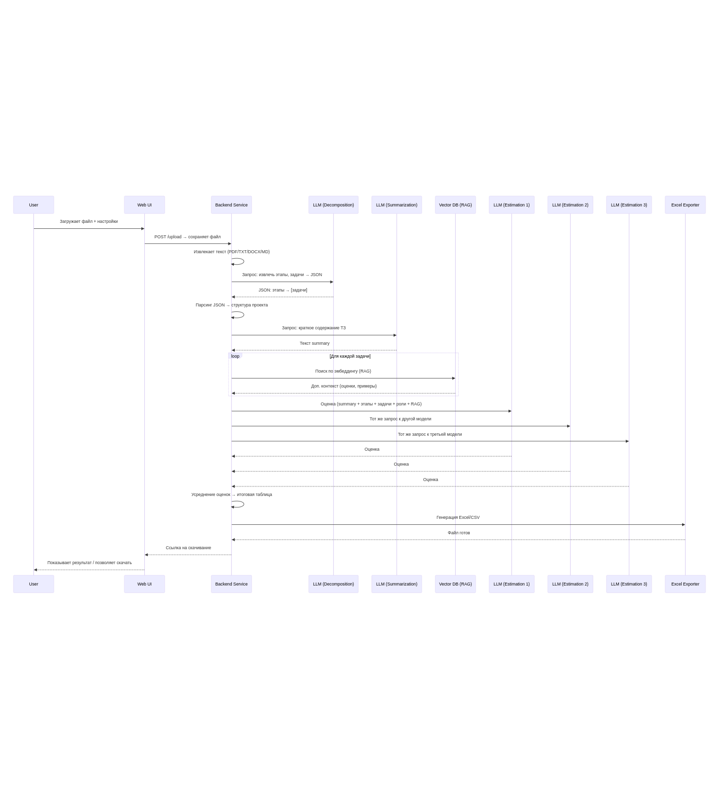
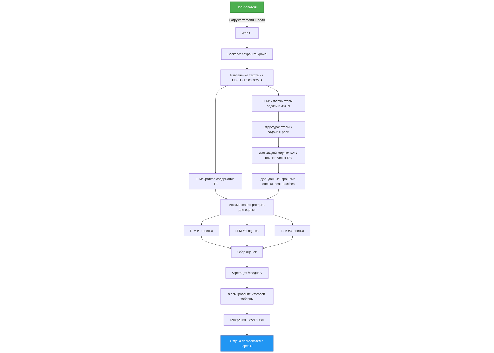

# Estima
## Итоговый проект по второй части курса DLS (МФТИ ФПМИ)
AI-ассистент для объективной оценки трудозатрат при реализации ИТ-проектов. 
Система автоматизирует анализ технических заданий и брифов, преобразуя неструктурированные требования в детализированную оценку в человеко-часах с разбивкой по ролям специалистов.

## Концепция
Традиционная оценка проектов требует участия опытных аналитиков и архитекторов, что занимает значительное время и подвержено субъективности. 
Estima решает эту проблему, комбинируя три ключевых подхода:
1. **Глубокая декомпозиция.** LLM анализирует исходный документ и выделяет логические этапы работ с детализацией до конкретных задач, сохраняя контекст требований заказчика. 
2. **Обогащение внешними знаниями.** Для каждой выделенной задачи система обращается к векторной базе знаний, содержащей знания об оценках аналогичных задач и отраслевые лучшие практики. Это позволяет учитывать реальный опыт реализации, а не только теоретические предположения. 
3. **Ансамблирование оценок.** Несколько независимых языковых моделей (LLM) выполняют оценку каждой задачи. Итоговый результат формируется путем усреднения, что снижает влияние ошибок отдельных моделей и повышает стабильность прогноза.

## Как это работает
1. Пользователь загружает документ с описанием проекта (ТЗ, бриф, спецификация) в формате PDF, TXT, DOCX, или Markdown и указывает желаемые роли специалистов.
2. Система извлекает текстовое содержимое и с помощью LLM формирует краткое резюме документа с сохранением ключевых аспектов: архитектурных требований, ограничений по производительности и безопасности, особенностей доменной области.
3. LLM выполняет структурированную декомпозицию проекта:
    - выделяет этапы работ (например, "Анализ требований", "Разработка backend", "Интеграционное тестирование");
    - для каждого этапа определяет конкретные задачи с комментариями по реализации;
4. Для каждой задачи система ищет релевантные примеры в векторной базе знаний - оценки схожих задач и рекомендации по реализации.
5. Формируется расширенный промпт для финальной оценки, включающий:
    - краткое содержание исходного документа;
    - структуру этапов и задач;
    - список задействованных ролей;
    - контекст из векторной базы знаний;
6. Несколько разных LLM независимо оценивают каждую задачу в человеко-часах для каждой роли.
7. Оценки агрегируются, и результат оформляется в табличном виде с разбивкой по этапам, задачам и ролям.

## Архитектурные особенности

- **Модульный конвейер обработки.** Последовательность этапов (анализ > декомпозиция > обогащение знаниями > оценка) реализована, как оркестрированный workflow, что обеспечивает прозрачность и возможность модификации отдельных компонентов.
- **Поддержка многоформатных входных данных.** Обработка документов различных форматов без потери семантического содержания.
- **Фокус на интерпретируемость.** Каждая оценка сопровождается контекстом из исходного документа и ссылками на аналогичные задачи из базы знаний, что позволяет аналитику понимать логику расчётов.

## Результат работы
На выходе пользователь получает структурированный файл (Excel или CSV) с детализированной оценкой проекта:
- Перечень этапов работ с комментариями.
- Список задач для каждого этапа.
- Оценка трудозатрат в человеко-часах по каждой роли (backend, frontend, аналитик, архитектор, QA, PM, DevOps...).
- Итоговые суммарные оценки по этапам и проекту в целом.

### Диаграмма последовательности

### Блок-схема

